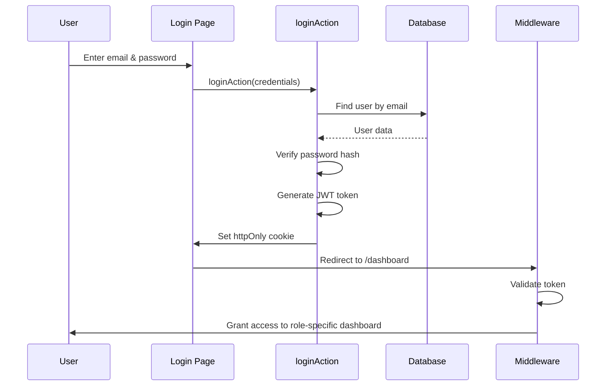
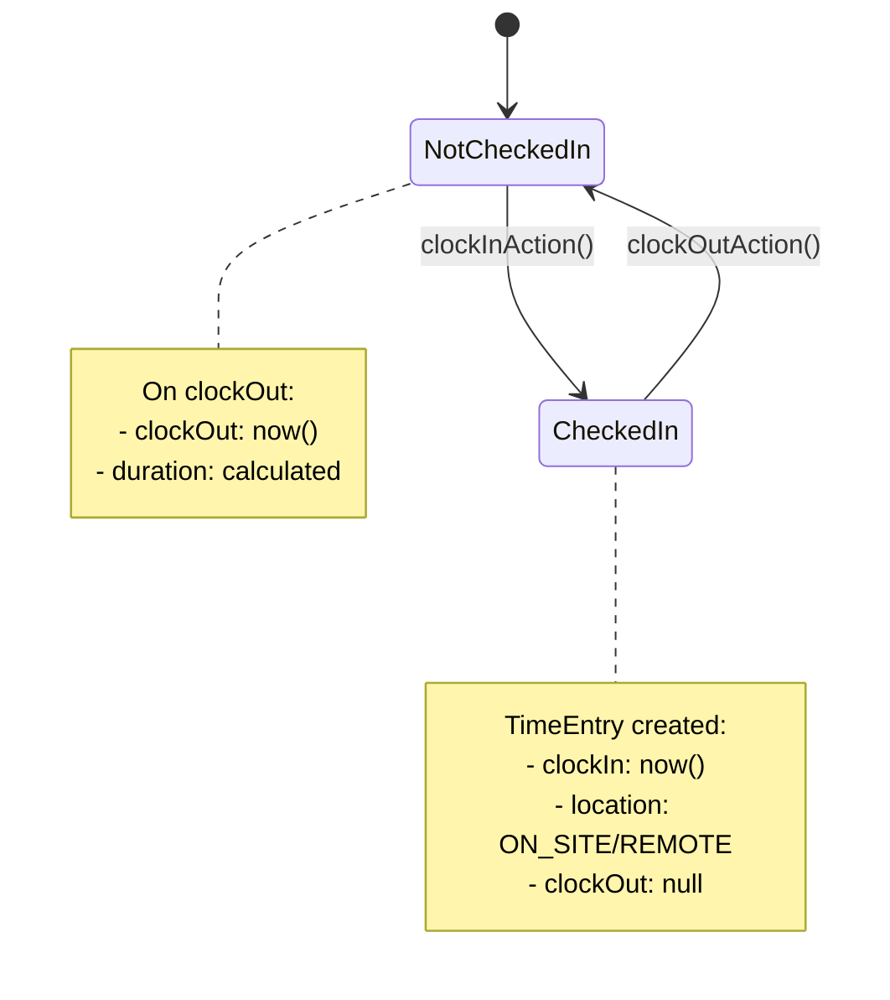
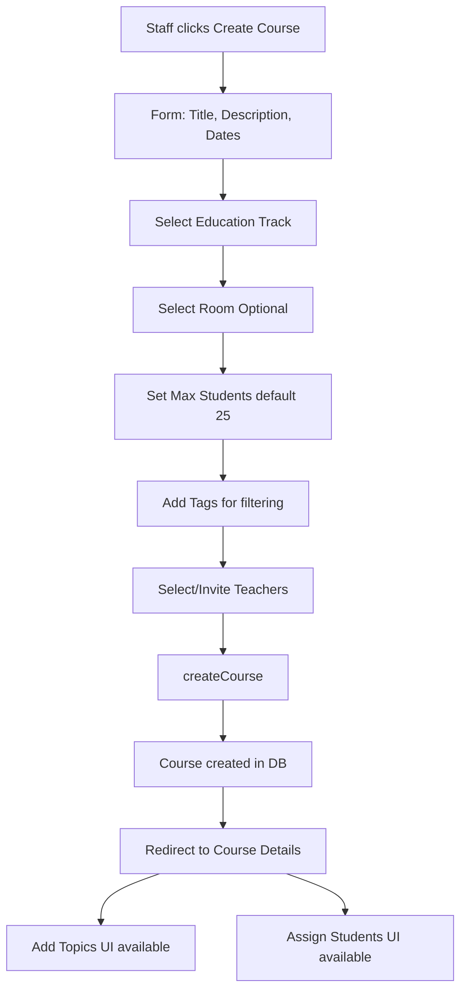
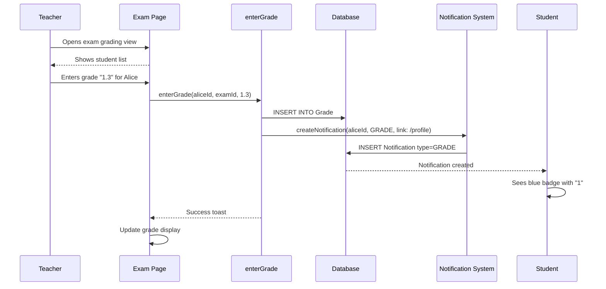
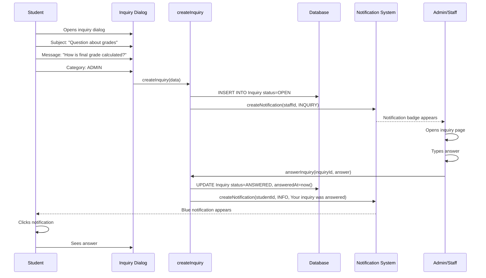
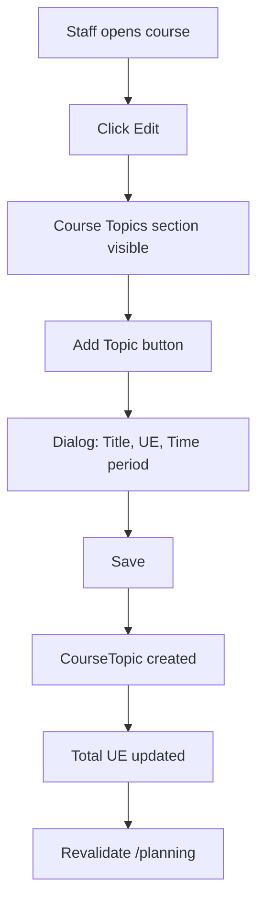
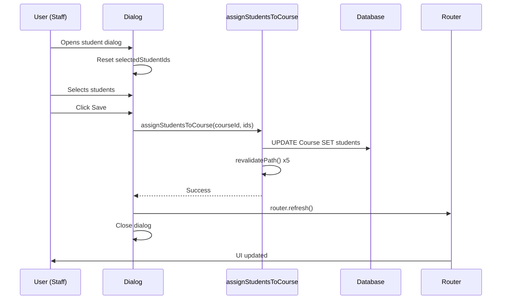
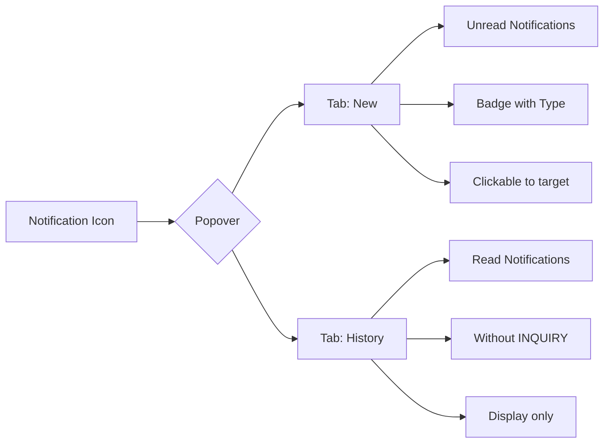
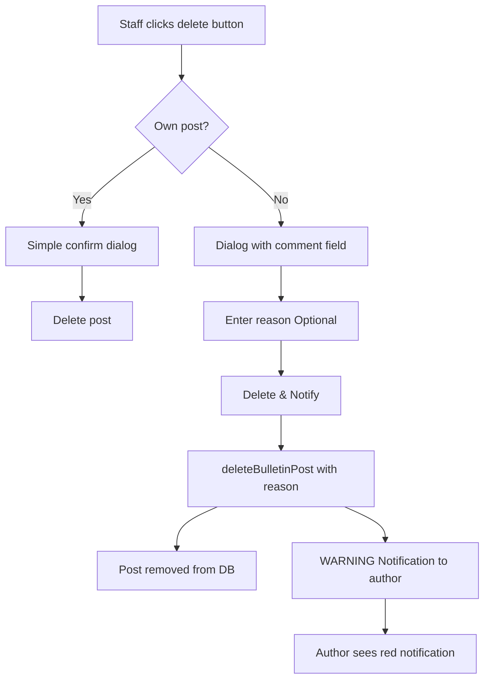
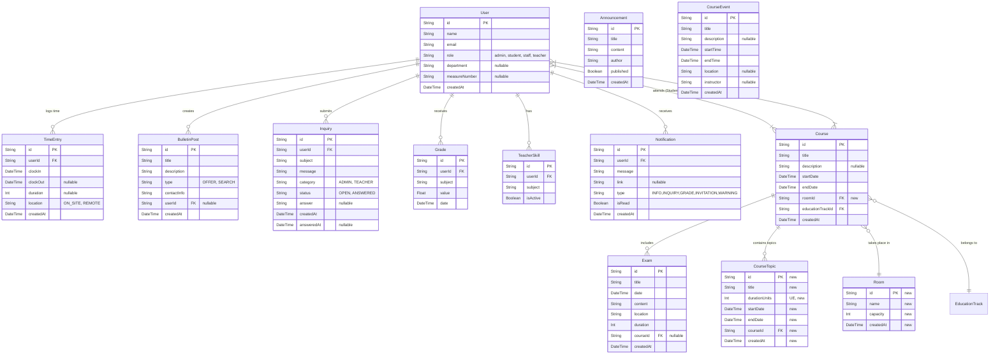

# Schul-Portal-Demo - Technical Documentation

## 📋 Complete Feature Catalog & Use Cases

This section provides comprehensive documentation for **ALL** features in the Schul-Portal-Demo system. Each feature includes use cases, technical implementation, and user workflows.

---

### 🔐 1. Authentication & Role-Based Access Control (RBAC)

**Purpose:** Secure login system with role-specific access and protection.

**Use Cases:**
- **UC-AUTH-01:** Student logs in with credentials and sees student-only dashboard
- **UC-AUTH-02:** Admin attempts to access admin panel - system verifies role before granting access
- **UC-AUTH-03:** Unauthenticated user tries to access protected route - redirected to login

**Technical Implementation:**
- JWT-based authentication with httpOnly cookies
- Middleware at `middleware.ts` validates tokens on every request
- Role hierarchy: `admin` > `staff` > `teacher` > `student`
- Route protection: `/admin/*` only for admins, `/staff/*` only for staff/admins

**API Actions:**
- `loginAction(email, password)` - Authenticates user, sets cookie
- `logoutAction()` - Clears session cookie
- `getSession()` - Server-side session validation

**Workflow:**


---

### ⏱️ 2. Time Tracking System

**Purpose:** Legal-compliant check-in/check-out system for students with location tracking (ON_SITE / REMOTE).

**Use Cases:**
- **UC-TIME-01:** Student arrives at school, clicks "Check In" - timestamp recorded with location ON_SITE
- **UC-TIME-02:** Student working from home, selects REMOTE location, checks in
- **UC-TIME-03:** Student forgets to check out - staff can manually close open time entries
- **UC-TIME-04:** Staff views weekly time report for all students to verify attendance
- **UC-TIME-05:** Student views personal time history to track hours

**Technical Implementation:**
```prisma
model TimeEntry {
  id       String    @id @default(cuid())
  userId   String
  clockIn  DateTime  @default(now())
  clockOut DateTime?
  duration Int?      // Minutes, calculated on clockOut
  location String    @default("ON_SITE") // ON_SITE or REMOTE
}
```

**API Actions:**
- `clockInAction(location: "ON_SITE" | "REMOTE")` - Creates new TimeEntry
- `clockOutAction()` - Updates latest open entry with clockOut, calculates duration
- `getTimeEntriesForUser(userId, startDate, endDate)` - Fetch filtered entries
- `getTotalHoursThisWeek(userId)` - Aggregates duration for reporting

**Workflow:**


**UI Components:**
- `/app/time/page.tsx` - Time dashboard with check-in/out buttons
- Clock-in button only visible when no active entry
- Location selector (ON_SITE/REMOTE) before check-in
- Weekly summary chart showing hours per day

---

### 🎓 3. Education Track Management

**Purpose:** Organize students into cohorts (e.g., "Fachinformatiker Winter 2025") with assigned courses.

**Use Cases:**
- **UC-TRACK-01:** Staff creates new education track "Winter 2026" with 2-year duration
- **UC-TRACK-02:** Admin assigns 15 students to "Winter 2025" track
- **UC-TRACK-03:** Teacher views all courses belonging to specific track
- **UC-TRACK-04:** Student dashboard shows courses filtered by their track

**Technical Implementation:**
```prisma
model EducationTrack {
  id        String   @id @default(cuid())
  title     String
  startDate DateTime
  endDate   DateTime
  users     User[]   // Students in cohort
  courses   Course[] // Courses for this cohort
}
```

**API Actions:**
- `createEducationTrack(title, startDate, endDate)` - Creates new cohort
- `assignStudentsToTrack(trackId, studentIds[])` - Bulk assignment
- `getCoursesForTrack(trackId)` - Filtered course list

---

### 📚 4. Course Management (Complete System)

**Purpose:** Full lifecycle management of courses including scheduling, room assignment, topics, and student enrollment.

**Use Cases:**
- **UC-COURSE-01:** Staff creates course "React Fundamentals" with 25 student max capacity
- **UC-COURSE-02:** Staff assigns Room 101 to course (NEW - January 2026)
- **UC-COURSE-03:** Staff breaks course into 4 topics with UE allocation (NEW - January 2026)
- **UC-COURSE-04:** Staff assigns 18 students to course - dialog shows real-time update
- **UC-COURSE-05:** Staff invites 2 teachers to course via email
- **UC-COURSE-06:** Teacher accepts/rejects course invitation
- **UC-COURSE-07:** Student views enrolled courses in dashboard with room and schedule
- **UC-COURSE-08:** Staff adds tags to course (e.g., "JavaScript", "Frontend") for filtering

**Technical Implementation:**
```prisma
model Course {
  id               String   @id @default(cuid())
  title            String
  description      String?
  startDate        DateTime
  endDate          DateTime
  maxStudents      Int      @default(25)
  
  // NEW: Room assignment
  roomId           String?
  room             Room?    @relation(fields: [roomId], references: [id])
  
  // Relations
  educationTrackId String?
  students         User[]   @relation("StudentCourses")
  teachers         User[]   @relation("TeacherCourses")
  topics           CourseTopic[] // NEW: Structured topics
  exams            Exam[]
  invitations      CourseInvitation[]
  tags             CourseTag[]
}
```

**API Actions:**
- `createCourse(data)` - Creates course with validation
- `updateCourse(courseId, data)` - Edits course details
- `assignStudentsToCourse(courseId, studentIds[])` - Bulk student enrollment (with 5-path revalidation)
- `inviteTeacherToCourse(courseId, teacherId)` - Sends invitation notification
- `acceptCourseInvitation(invitationId)` - Adds teacher to course
- `rejectCourseInvitation(invitationId)` - Updates invitation status

**Workflow - Course Creation:**


---

### 📍 5. Room and Location Management ⭐ NEW

**Purpose:** Physical space assignment for courses with capacity tracking.

**Use Cases:**
- **UC-ROOM-01:** Admin creates room "Room 101" with 30 capacity
- **UC-ROOM-02:** Staff assigns Room 101 to "React Fundamentals" course
- **UC-ROOM-03:** System prevents over-booking - warns if course students exceed room capacity
- **UC-ROOM-04:** Student views course details including room location

**Technical Implementation:**
```prisma
model Room {
  id       String   @id @default(cuid())
  name     String   // "Room 101", "Remote", "Aula"
  capacity Int      @default(30)
  courses  Course[]
  events   CourseEvent[]
}
```

**API Actions:**
- `createRoom(name, capacity)` - Creates new room
- `getAllRooms()` - Dropdown population for course forms
- `getRoomAvailability(roomId, startDate, endDate)` - Check scheduling conflicts

---

### 📚 6. Course Topics Management ⭐ NEW

**Purpose:** Break courses into structured topics with teaching units (UE) and time planning.

**Use Cases:**
- **UC-TOPIC-01:** Teacher plans "React Fundamentals" with 5 topics (Basics: 40 UE, Hooks: 40 UE, etc.)
- **UC-TOPIC-02:** Staff edits topic to adjust UE allocation from 40 to 45
- **UC-TOPIC-03:** Student views course syllabus with all topics and timeframes
- **UC-TOPIC-04:** System calculates total UE for course (sum of all topics)

**Technical Implementation:**
```prisma
model CourseTopic {
  id            String   @id @default(cuid())
  title         String
  durationUnits Int      // Teaching units (UE)
  startDate     DateTime
  endDate       DateTime
  courseId      String
  course        Course   @relation(fields: [courseId], references: [id], onDelete: Cascade)
}
```

**API Actions:**
- `createCourseTopicAction(courseId, title, durationUnits, startDate, endDate)` - Adds topic
- `updateCourseTopicAction(topicId, data)` - Edits existing topic
- `deleteCourseTopicAction(topicId)` - Removes topic with cascade

**UI Component:**
- `CourseTopicsManager` - CRUD interface with dialog, displays total UE
- Visual: Badge showing UE per topic, scrollable list, edit/delete buttons

---

### 📝 7. Exam Management

**Purpose:** Schedule exams, assign to courses, track exam details and locations.

**Use Cases:**
- **UC-EXAM-01:** Teacher creates exam "React Basics Test" for course on Jan 20, 2026
- **UC-EXAM-02:** Teacher specifies exam duration (120 minutes) and location (Room 201)
- **UC-EXAM-03:** Student views upcoming exams in dashboard with countdown
- **UC-EXAM-04:** Teacher enters grades after exam completion
- **UC-EXAM-05:** System notifies students when exam grades are published

**Technical Implementation:**
```prisma
model Exam {
  id       String   @id @default(cuid())
  title    String
  date     DateTime
  content  String   // Exam description/topics covered
  location String
  duration Int      // Minutes
  courseId String?
  course   Course?  @relation(fields: [courseId], references: [id])
  grades   Grade[]
}
```

**API Actions:**
- `createExam(courseId, title, date, content, location, duration)` - Schedules exam
- `updateExam(examId, data)` - Edit exam details
- `deleteExam(examId)` - Cancels exam
- `getUpcomingExamsForStudent(userId)` - Filtered by enrolled courses

---

### 📊 8. Grading System

**Purpose:** Teachers enter grades for exams, students receive notifications and can view their grade history.

**Use Cases:**
- **UC-GRADE-01:** Teacher opens exam "React Basics Test", sees list of 18 students
- **UC-GRADE-02:** Teacher enters grade "1.3" for student Alice
- **UC-GRADE-03:** System creates GRADE notification for Alice with link to profile
- **UC-GRADE-04:** Alice receives blue badge notification "New grade: 1.3 for React Basics Test"
- **UC-GRADE-05:** Student views all grades in profile with average calculation

**Technical Implementation:**
```prisma
model Grade {
  id      String   @id @default(cuid())
  userId  String
  user    User     @relation(fields: [userId], references: [id])
  examId  String?
  exam    Exam?    @relation(fields: [examId], references: [id])
  subject String   // Fallback if no exam
  value   Float    // e.g., 1.3, 2.7
  date    DateTime @default(now())
}
```

**API Actions:**
- `enterGrade(userId, examId, value)` - Creates grade and GRADE notification
- `updateGrade(gradeId, newValue)` - Edit existing grade
- `getGradesForStudent(userId)` - Profile view
- `calculateAverageGrade(userId)` - Math.average of all grades

**Workflow:**


---

### 📌 9. Bulletin Board (Marketplace)

**Purpose:** "Search/Offer" marketplace for students and staff to post items, services, or requests.

**Use Cases:**
- **UC-BULLETIN-01:** Student posts "OFFER: Selling old laptop €200"
- **UC-BULLETIN-02:** Student posts "SEARCH: Looking for study group for React exam"
- **UC-BULLETIN-03:** Staff views all posts, sees inappropriate content
- **UC-BULLETIN-04:** Staff deletes post with reason "Commercial advertising not allowed" (NEW - moderation)
- **UC-BULLETIN-05:** Post author receives WARNING notification with deletion reason
- **UC-BULLETIN-06:** Posts auto-expire after set date (optional feature)

**Technical Implementation:**
```prisma
model BulletinPost {
  id          String   @id @default(cuid())
  title       String
  description String
  type        String   // "OFFER" or "SEARCH"
  contactInfo String
  userId      String?  // Nullable for guest posts
  user        User?    @relation(fields: [userId], references: [id])
  expiresAt   DateTime? // Optional expiration
  createdAt   DateTime @default(now())
}
```

**API Actions:**
- `createBulletinPost(title, description, type, contactInfo)` - Creates post
- `deleteBulletinPost(postId, deletionReason?)` - Deletes with optional moderation comment (NEW)
- `getAllBulletinPosts()` - Fetches active posts (excludes expired)

**Moderation Workflow (NEW - January 2026):**
```mermaid
graph TD
    A[Staff sees post] --> B{Own post?}
    B -->|Yes| C[Simple delete]
    B -->|No| D[Delete button shows dialog]
    D --> E[Staff enters reason: "Spam"]
    E --> F[Click Delete & Notify]
    F --> G[deleteBulletinPost with reason]
    G --> H[Post removed from DB]
    G --> I[WARNING notification to author]
    I --> J[Author sees: Red badge]
    J --> K[Message: Your post was removed. Reason: Spam]
```

---

### 📧 10. Inquiry System

**Purpose:** Direct communication channel for students to contact administration or teachers with questions.

**Use Cases:**
- **UC-INQUIRY-01:** Student has question about enrollment, creates inquiry to ADMIN category
- **UC-INQUIRY-02:** Admin receives INQUIRY notification (does NOT appear in history tab)
- **UC-INQUIRY-03:** Admin opens inquiry, types answer, clicks "Submit Answer"
- **UC-INQUIRY-04:** Student receives INFO notification "Your inquiry was answered"
- **UC-INQUIRY-05:** Student views answered inquiry with response
- **UC-INQUIRY-06:** Staff filters inquiries by status (OPEN / ANSWERED)

**Technical Implementation:**
```prisma
model Inquiry {
  id          String   @id @default(cuid())
  userId      String
  user        User     @relation(fields: [userId], references: [id])
  recipientId String?  // Staff member who answered
  recipient   User?    @relation("ReceivedInquiries", fields: [recipientId], references: [id])
  subject     String
  message     String
  category    String   // "ADMIN" or "TEACHER"
  status      String   @default("OPEN") // "OPEN" or "ANSWERED"
  answer      String?
  createdAt   DateTime @default(now())
  answeredAt  DateTime?
}
```

**API Actions:**
- `createInquiry(subject, message, category)` - Creates inquiry, sends INQUIRY notification to staff
- `answerInquiry(inquiryId, answer)` - Updates inquiry, creates INFO notification for student
- `getOpenInquiries()` - Staff view filtered by status=OPEN
- `getInquiriesForUser(userId)` - Student's inquiry history

**Workflow:**


---

### 🔔 11. Intelligent Notification System ⭐ ENHANCED

**Purpose:** Type-based notification system with auto-dismiss, history tracking, and role-specific alerts.

**Use Cases:**
- **UC-NOTIF-01:** Student receives grade - sees BLUE badge "New grade: 1.3"
- **UC-NOTIF-02:** Teacher receives course invitation - sees GRAY badge "Invitation"
- **UC-NOTIF-03:** Student clicks grade notification - auto-dismissed, navigates to profile, UI refreshes
- **UC-NOTIF-04:** Staff receives inquiry - stays in "New" tab, does NOT move to history
- **UC-NOTIF-05:** Student views history tab - sees past grades and invitations, but NO inquiries
- **UC-NOTIF-06:** Post author receives WARNING notification - sees RED badge with deletion reason

**Technical Implementation:**
```prisma
model Notification {
  id        String   @id @default(cuid())
  userId    String
  user      User     @relation(fields: [userId], references: [id])
  message   String
  link      String?  // Deep link URL
  type      String   @default("INFO") // INFO, INQUIRY, GRADE, INVITATION, WARNING
  isRead    Boolean  @default(false)
  createdAt DateTime @default(now())
}
```

**Notification Types:**
- `INFO` - General information (gray badge)
- `INQUIRY` - Inquiries (gray badge, NOT in history)
- `GRADE` - Grade entries (blue badge, in history)
- `INVITATION` - Course invitations (gray badge, in history)
- `WARNING` - Warnings/Alerts (red badge, in history)

**API Actions:**
- `createNotification(userId, message, link?, type = "INFO")` - Creates typed notification
- `markNotificationAsRead(notificationId)` - Sets isRead=true
- `getUnreadNotifications(userId)` - Fetch for "New" tab
- `getReadNotifications(userId)` - Fetch for "History" tab (excludes INQUIRY type, limits 50)

**UI Architecture:**
```mermaid
graph LR
    A[Bell Icon with Badge Count] --> B{User Clicks}
    B --> C[Popover Opens]
    C --> D[Tabs: New | History]
    D --> E[New Tab]
    D --> F[History Tab]
    
    E --> G[Unread Notifications]
    G --> H[Type Badge Color]
    G --> I[Clickable with Link]
    
    F --> J[Read Notifications]
    J --> K[Exclude INQUIRY type]
    J --> L[Last 50 entries]
    J --> M[Gray/transparent styling]
    
    I --> N[Click Handler]
    N --> O[markAsRead]
    N --> P[Close Popover]
    N --> Q[router.push link]
    N --> R[router.refresh]
```

**Auto-Dismiss Logic:**
```typescript
const handleNotificationClick = async (notification) => {
  if (notification.link) {
    await markNotificationAsRead(notification.id);
    setOpen(false);  // Close popover
    router.push(notification.link);
    router.refresh();  // Update UI
  }
};
```

---

### 👥 12. User Management (Admin Only)

**Purpose:** CRUD operations for users, role assignment, department configuration.

**Use Cases:**
- **UC-USER-01:** Admin creates new student "Max Mustermann" with measure number 123/456/2024
- **UC-USER-02:** Admin assigns student to education track "Winter 2026"
- **UC-USER-03:** Admin promotes user from "student" to "teacher" role
- **UC-USER-04:** Admin views list of all users with filter by role
- **UC-USER-05:** Admin deletes inactive user account

**Technical Implementation:**
```prisma
model User {
  id               String   @id @default(cuid())
  name             String
  email            String   @unique
  role             String   @default("user") // admin, student, staff, teacher
  department       String?  // For admin/staff
  measureNumber    String?  // For students: 123/456/2024
  educationTrackId String?
  educationTrack   EducationTrack? @relation(fields: [educationTrackId], references: [id])
}
```

**API Actions:**
- `createUser(name, email, password, role, department?, measureNumber?)` - Creates new user
- `updateUser(userId, data)` - Edit user details including role
- `deleteUser(userId)` - Soft delete or hard delete with cascade
- `getAllUsers(roleFilter?)` - Admin view with optional filtering

---

### 🎯 13. Teacher Skills & Tags System

**Purpose:** Tag-based skill management for teachers, enables course-teacher matching.

**Use Cases:**
- **UC-SKILL-01:** Teacher adds skill "React" to profile, sets active=true
- **UC-SKILL-02:** Admin reviews pending skill requests, verifies "React" skill
- **UC-SKILL-03:** Staff creates course with tag "React", system suggests teachers with verified React skill
- **UC-SKILL-04:** Teacher deactivates skill "Angular" (temporarily unavailable)

**Technical Implementation:**
```prisma
model TeacherSkill {
  id         String  @id @default(cuid())
  userId     String
  user       User    @relation(fields: [userId], references: [id])
  tagId      String
  tag        Tag     @relation(fields: [tagId], references: [id])
  isVerified Boolean @default(false) // Admin approved
  isActive   Boolean @default(true)  // Teacher availability
  @@unique([userId, tagId])
}

model Tag {
  id      String   @id @default(cuid())
  name    String   @unique
  skills  TeacherSkill[]
  courses CourseTag[]
}
```

**API Actions:**
- `addTeacherSkill(teacherId, tagName)` - Creates skill with isVerified=false
- `verifyTeacherSkill(skillId)` - Admin approval, sets isVerified=true
- `toggleSkillAvailability(skillId, isActive)` - Teacher enables/disables skill
- `getTeachersBySkill(tagName)` - Course creation helper

---

### 👤 14. Student Profile & Dashboard

**Purpose:** Personalized view for students showing courses, grades, time tracking, and notifications.

**Use Cases:**
- **UC-PROFILE-01:** Student logs in, sees dashboard with enrolled courses
- **UC-PROFILE-02:** Student views weekly schedule with course times and rooms
- **UC-PROFILE-03:** Student clicks "Profile" to see all grades with average
- **UC-PROFILE-04:** Student views time tracking summary for current week
- **UC-PROFILE-05:** Student receives notification about new exam

**UI Components:**
- Dashboard: Upcoming courses, recent notifications, quick actions
- Profile page: Grades table, average calculation, personal details
- Time page: Check-in/out buttons, weekly summary chart

---

### 🧑‍🏫 15. Teacher Dashboard

**Purpose:** Course management, exam creation, grading interface for teachers.

**Use Cases:**
- **UC-TEACHER-01:** Teacher views assigned courses
- **UC-TEACHER-02:** Teacher creates exam for course
- **UC-TEACHER-03:** Teacher enters grades for exam
- **UC-TEACHER-04:** Teacher views course invitations
- **UC-TEACHER-05:** Teacher updates skill availability

---

### 🏢 16. Staff Dashboard & Planning

**Purpose:** Administrative interface for course planning, track management, student assignment.

**Use Cases:**
- **UC-STAFF-01:** Staff creates new education track "Winter 2027"
- **UC-STAFF-02:** Staff creates course with room, topics, and students
- **UC-STAFF-03:** Staff views all courses in planning view with filters
- **UC-STAFF-04:** Staff assigns 15 students to course with real-time refresh
- **UC-STAFF-05:** Staff reviews bulletin board for inappropriate content

---

## 🆕 Current Features (January 2026)

### 1. 📍 Room and Location Management
**Problem:** Courses had no physical assignment to rooms or locations.

**Solution:**
- New `Room` model with capacity and name
- `Course.roomId` relationship for direct room assignment
- Dropdown selection during course creation and editing
- Demo rooms: Room 101, 102, 201, Remote/Online, Aula

**Technical Implementation:**
```prisma
model Course {
  roomId  String?
  room    Room? @relation(fields: [roomId], references: [id])
}

model Room {
  id       String   @id @default(cuid())
  name     String
  capacity Int      @default(30)
  courses  Course[]
}
```

### 2. 📚 Course Topics Management
**Problem:** Courses were monolithic blocks without structured subdivision into topics with time planning.

**Solution:**
- `CourseTopic` model with title, UE (teaching units), start and end date
- Visual component `CourseTopicsManager` with CRUD functions
- Display of total UE per course
- Time planning of individual topic blocks

**Workflow:**


**API Actions:**
- `createCourseTopicAction()` - Create new topic
- `updateCourseTopicAction()` - Edit topic
- `deleteCourseTopicAction()` - Delete topic

### 3. 🔄 Student Assignment Fix
**Problem:** After assigning students to courses, no visual feedback was visible, students didn't see courses in their calendar.

**Solution:**
- Dialog resets `selectedStudentIds` on open (fresh data)
- Extended revalidation: `/planning`, `/planning/course/{id}`, `/courses`, `/student`, `/dashboard`
- Automatic popover close after action
- `router.refresh()` for immediate UI update

**Data Flow:**


### 4. 🔔 Intelligent Notification System

**Problem:** All notifications were the same, no history, no auto-dismiss.

**Solution:**

#### 4.1 Notification Types
- `INFO` - General information
- `INQUIRY` - Inquiries (NOT saved in history)
- `GRADE` - Grade entries (blue badge)
- `INVITATION` - Course invitations (gray badge)
- `WARNING` - Warnings, e.g. post deletions (red badge)

#### 4.2 Auto-Dismiss on Click
When a notification with link is clicked:
1. Notification marked as read (`isRead = true`)
2. Popover closes automatically
3. Navigation to linked page
4. `router.refresh()` updates UI

**Code Flow:**
```typescript
const handleNotificationClick = (notification) => {
  if (notification.link) {
    await markNotificationAsRead(notification.id);
    setOpen(false);  // Close popover
    router.push(notification.link);
    router.refresh();
  }
}
```

#### 4.3 History Tab
- Separate "History" tab next to "New"
- Shows only read notifications (except INQUIRY type)
- Limited to last 50 entries
- Visual distinction: gray/transparent, smaller font

**UI Structure:**


### 5. 🗑️ Post Deletion with Comment

**Problem:** Staff could delete posts, but authors didn't know why.

**Solution:**

#### Workflow for Staff:


**Notification Message:**
```
"Your post '[Title]' was removed by administration. 
Reason: [Comment or empty]"
```

**Technical Implementation:**
- `DeletePostButton` has `needsReason` prop
- Conditional dialog vs. confirm
- `deleteBulletinPost(postId, deletionReason?)` 
- Automatic WARNING notification with type and red badge

---

## 🚀 Features for Future Planning

The following features and improvements are planned for upcoming iterations of the Schul-Portal-Demo. These aim to enhance scalability, user experience, and administrative control.

### 1. 🏗️ Architecture & Database Redesign
*   **Database Schema Optimization:** Re-evaluate existing relationships to reduce redundancy and support more complex query patterns (e.g., historical tracking of grade changes).
*   **Performance Tuning:** Implement database indexing strategies and analyze query performance to prevent bottlenecks as data volume grows.
*   **Scalability Check:** Ensure the database design can handle a significant increase in concurrent users and data entries over the next 2-3 years.

### 2. 🎨 UI/UX Overhaul
*   **Modern Design Language:** Refresh the user interface with a more cohesive and accessible design system, ensuring consistent spacing, typography, and color usage.
*   **Mobile Responsiveness:** rigorously test and improve mobile layouts for all roles, ensuring seamless usage on smartphones and tablets.
*   **Accessibility (a11y):** Audit the entire application for WCAG 2.1 compliance to support users with disabilities (screen readers, keyboard navigation).

### 3. 🧪 Comprehensive Testing Strategy
*   **Expanded Test Coverage:** Move beyond basic unit tests to include integration and end-to-end (E2E) tests covering critical user flows.
*   **Edge Case Scenarios:** specifically target edge cases in role-based access and data validation.
*   **Automated Regression Testing:** Implement CI/CD pipelines that run comprehensive test suites on every pull request to prevent regressions.

### 4. 📂 Document Management System (DMS) / File Uploads
*   **Teacher Resources:** Enable teachers to upload lecture notes, slides, and supplementary materials directly to their courses.
    *   *Non-Technical Guide:* Create a simple, drag-and-drop interface with clear instructions (e.g., "Drag your PDF here") to minimize friction for non-technical staff.
*   **Student Assignments:** Allow students to upload homework and project files directly to specific course modules.
*   **CMS Integration:** Consider integrating a lightweight Headless CMS (like Strapi or Contentful) or building a dedicated DMS module for handling file versioning and permissions.

### 5. 💬 Enhanced Course Interaction
*   **Course Comments/Announcements:** Add a "Teacher's Board" to each course where instructors can post updates, tech stack details (e.g., "We will use React 19 & Tailwind"), or last-minute changes.
*   **Tech Stack Specification:** Allow teachers to define the specific technologies used in a course module (e.g., version numbers, required software) visible in the course overview.

### 6. 🛠️ Advanced Admin Support Tools
*   **Impersonation Mode:** Allow admins to "view as" a specific user to troubleshoot issues exactly as the user sees them.
*   **Audit Logs:** Implement detailed logging of all administrative actions (who changed what and when) for security and accountability.
*   **System Health Dashboard:** visual real-time metrics for server load, database connections, and error rates.

### 7. 📌 Bulletin Board Enhancements
*   **Expiration Management:** Users can set an expiration date (3, 7, 14, 30 days) for their posts. Expired posts are visually distinguished (grayed out) or automatically archived.
*   **Search & Filter:** Advanced filtering by "Search" vs "Offer" and full-text search for post content.

---

## 1. Technical Implementation

This project is a modern intranet application built with **Next.js 15**, utilizing the App Router and Server Actions for a seamless full-stack experience. The system is designed to handle role-based access control (RBAC) for Students, Teachers, Staff, and Administrators.

### Core Stack
*   **Framework:** [Next.js 15](https://nextjs.org/) (App Router, Server Components)
*   **Language:** TypeScript
*   **Database:** PostgreSQL (via Prisma ORM)
*   **Authentication:** Custom JWT-based auth with secure cookie handling (stateless)
*   **UI Library:** [Tailwind CSS](https://tailwindcss.com/) + [shadcn/ui](https://ui.shadcn.com/)
*   **Icons:** Lucide React

### Key Concepts
*   **Server Actions:** Used for all data mutations (login, creating users, posting inquiries). This eliminates the need for a separate API layer for internal features.
*   **Middleware:** `middleware.ts` handles route protection, ensuring users can only access pages relevant to their role (e.g., `/admin` is locked for Students).
*   **Prisma ORM:** Provides type-safe database access. The schema is defined in `prisma/schema.prisma`.

---

## 2. Architecture

### Database Schema (ER Diagram)



### Git & Deployment Workflow

1.  **Development:** Features are developed in local branches.
2.  **Prisma Migration:** Database changes are applied via `npx prisma migrate dev`.
3.  **Build:** `npm run build` generates the production bundle.
4.  **Start:** `npm start` launches the optimized production server.

---

## 3. Critical Evaluation

### Code Quality & Architecture
*   **Strengths:**
    *   **Modular:** Components are well-separated (e.g., `sidebar.tsx`, `create-inquiry-dialog.tsx`).
    *   **Type-Safe:** TypeScript is used consistently, reducing runtime errors.
    *   **Secure:** Server Actions automatically handle CSRF protection; Middleware enforces auth rules.
*   **Weaknesses:**
    *   **Complexity:** Some server components mix data fetching and UI logic too tightly.
    *   **State Management:** Heavy reliance on local state (`useState`) in some complex forms could be improved with URL state or a global store if the app grows.

### Bottlenecks & Technical Debt
*   **Database Queries:** Some dashboard views might trigger N+1 query issues (e.g., fetching students then their time entries individually).
    *   *Fix:* Optimize Prisma queries using `include` or raw SQL for complex reports.
*   **Role Logic:** Role-based rendering is often done with simple `if` checks in JSX.
    *   *Fix:* Abstraction into `<RoleGuard role="admin">` components would be cleaner.

### Proposed Improvements
1.  **Refactoring:** Extract complex data fetching into dedicated "Service" files (e.g., `lib/services/user-service.ts`).
2.  **Performance:** Implement React `Suspense` for slow-loading dashboard widgets.
3.  **Testing:** Add E2E tests with Playwright to verify critical flows like "Login" and "Clock In".

---

## 4. Learnings

*   **Why Server Actions?** They simplify the mental model by keeping backend logic right next to the UI that triggers it, reducing context switching.
*   **Managing Roles:** Hardcoding roles (`if role === 'admin'`) is easy to start with but gets messy. A robust permission system (RBAC) would be better for scaling.
*   **Shadcn/UI:** While powerful, it requires "owning" the code. Customizing components takes more effort than using a pre-styled library like Bootstrap, but offers way more control.
