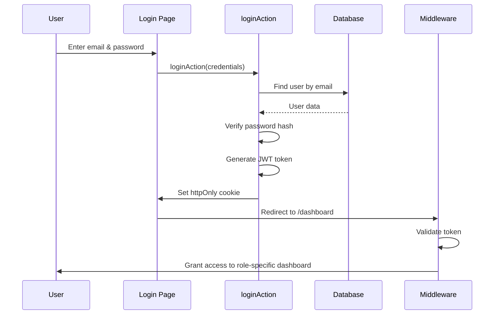
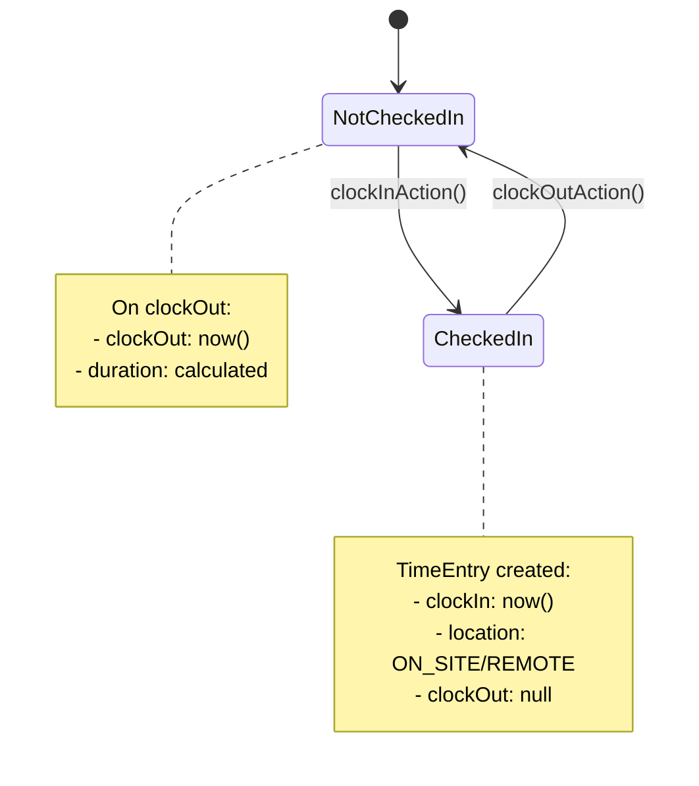
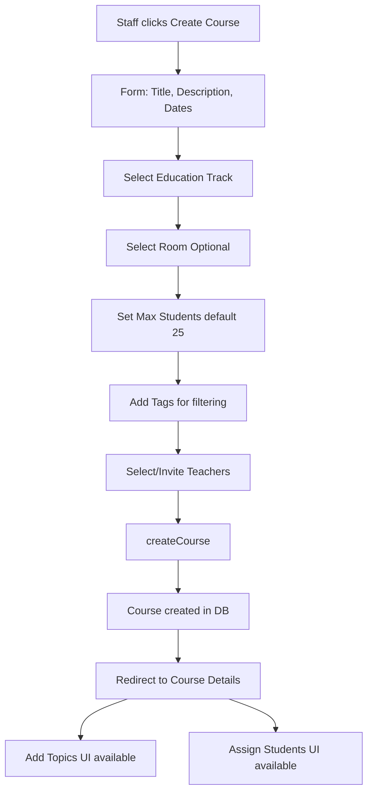

# Schul-Portal-Demo – Technische Dokumentation

## 📋 Vollständiger Feature-Katalog & Use Cases

Dieser Abschnitt dokumentiert **ALLE** Funktionen des Schul-Portal-Demo-Systems. Jede Funktion enthält Use Cases, technische Umsetzung und typische Nutzer-Workflows.

> Hinweis: Diese Datei enthält aktuell den übersetzten Teil bis einschließlich „Kursthemen-Verwaltung“. Der restliche Abschnitt (ab „Prüfungsverwaltung“) war in der Vorlage sehr lang und wurde hier noch nicht ergänzt.

---

### 🔐 1. Authentifizierung & Rollenbasierte Zugriffskontrolle (RBAC)

**Zweck:** Sicheres Login-System mit rollenbasiertem Zugriff und Schutz von Routen.

**Use Cases:**
- **UC-AUTH-01:** Schüler:in loggt sich mit Zugangsdaten ein und sieht ein reines Student-Dashboard
- **UC-AUTH-02:** Admin versucht, auf das Admin-Panel zuzugreifen – das System prüft die Rolle vor dem Zugriff
- **UC-AUTH-03:** Nicht authentifizierte Nutzer:innen öffnen eine geschützte Route – Weiterleitung zum Login

**Technische Umsetzung:**
- JWT-basierte Authentifizierung mit httpOnly-Cookies
- Middleware in `middleware.ts` validiert Tokens bei jeder Anfrage
- Rollen-Hierarchie: `admin` > `staff` > `teacher` > `student`
- Routenschutz: `/admin/*` nur für Admins, `/staff/*` nur für Staff/Admins

**API-Actions:**
- `loginAction(email, password)` – authentifiziert Nutzer:in, setzt Cookie
- `logoutAction()` – löscht Session-Cookie
- `getSession()` – serverseitige Session-Validierung

**Workflow:**


---

### ⏱️ 2. Zeiterfassungssystem

**Zweck:** Rechtskonformes Ein-/Auschecken für Schüler:innen mit Standort/Arbeitsort (ON_SITE / REMOTE).

**Use Cases:**
- **UC-TIME-01:** Schüler:in kommt in die Schule, klickt „Check In“ – Zeitstempel wird mit ON_SITE gespeichert
- **UC-TIME-02:** Schüler:in arbeitet von zu Hause, wählt REMOTE, checkt ein
- **UC-TIME-03:** Schüler:in vergisst auszuchecken – Staff kann offene Einträge manuell schließen
- **UC-TIME-04:** Staff sieht den Wochenreport aller Schüler:innen zur Anwesenheitsprüfung
- **UC-TIME-05:** Schüler:in sieht die eigene Zeithistorie zur Stundenkontrolle

**Technische Umsetzung:**
```prisma
model TimeEntry {
  id       String    @id @default(cuid())
  userId   String
  clockIn  DateTime  @default(now())
  clockOut DateTime?
  duration Int?      // Minutes, calculated on clockOut
  location String    @default("ON_SITE") // ON_SITE or REMOTE
}
```

**API-Actions:**
- `clockInAction(location: "ON_SITE" | "REMOTE")` – erstellt neuen TimeEntry
- `clockOutAction()` – aktualisiert den letzten offenen Eintrag (clockOut) und berechnet duration
- `getTimeEntriesForUser(userId, startDate, endDate)` – lädt gefilterte Einträge
- `getTotalHoursThisWeek(userId)` – aggregiert duration für Reports

**Workflow:**


**UI-Komponenten:**
- `/app/time/page.tsx` – Zeit-Dashboard mit Check-in/out Buttons
- „Clock In“ nur sichtbar, wenn kein aktiver Eintrag existiert
- Standort-Auswahl (ON_SITE/REMOTE) vor dem Check-in
- Wochenübersicht (Chart) mit Stunden pro Tag

---

### 🎓 3. Jahrgangs-/Bildungsgangverwaltung

**Zweck:** Organisation von Schüler:innen in Kohorten (z. B. „Fachinformatiker Winter 2025“) mit zugewiesenen Kursen.

**Use Cases:**
- **UC-TRACK-01:** Staff erstellt einen neuen Jahrgang „Winter 2026“ mit 2 Jahren Laufzeit
- **UC-TRACK-02:** Admin weist 15 Schüler:innen dem Jahrgang „Winter 2025“ zu
- **UC-TRACK-03:** Lehrkraft sieht alle Kurse eines bestimmten Jahrgangs
- **UC-TRACK-04:** Student-Dashboard zeigt Kurse gefiltert nach dem eigenen Jahrgang

**Technische Umsetzung:**
```prisma
model EducationTrack {
  id        String   @id @default(cuid())
  title     String
  startDate DateTime
  endDate   DateTime
  users     User[]   // Students in cohort
  courses   Course[] // Courses for this cohort
}
```

**API-Actions:**
- `createEducationTrack(title, startDate, endDate)` – erstellt neuen Jahrgang
- `assignStudentsToTrack(trackId, studentIds[])` – Bulk-Zuweisung
- `getCoursesForTrack(trackId)` – gefilterte Kursliste

---

### 📚 4. Kursverwaltung (vollständiges System)

**Zweck:** Vollständiger Kurs-Lifecycle: Planung, Raumzuweisung, Themen, Einschreibung.

**Use Cases:**
- **UC-COURSE-01:** Staff erstellt „React Fundamentals“ mit max. 25 Teilnehmenden
- **UC-COURSE-02:** Staff weist Raum 101 zu (NEU – Januar 2026)
- **UC-COURSE-03:** Staff gliedert den Kurs in 4 Themen mit UE (NEU – Januar 2026)
- **UC-COURSE-04:** Staff weist 18 Schüler:innen zu – Dialog aktualisiert in Echtzeit
- **UC-COURSE-05:** Staff lädt 2 Lehrkräfte per Einladung ein
- **UC-COURSE-06:** Lehrkraft nimmt Einladung an/lehnen ab
- **UC-COURSE-07:** Schüler:in sieht eingeschriebene Kurse inkl. Raum und Zeitplan
- **UC-COURSE-08:** Staff vergibt Tags (z. B. „JavaScript“, „Frontend“) zum Filtern

**Technische Umsetzung:**
```prisma
model Course {
  id               String   @id @default(cuid())
  title            String
  description      String?
  startDate        DateTime
  endDate          DateTime
  maxStudents      Int      @default(25)

  // NEW: Room assignment
  roomId           String?
  room             Room?    @relation(fields: [roomId], references: [id])

  // Relations
  educationTrackId String?
  students         User[]   @relation("StudentCourses")
  teachers         User[]   @relation("TeacherCourses")
  topics           CourseTopic[] // NEW: Structured topics
  exams            Exam[]
  invitations      CourseInvitation[]
  tags             CourseTag[]
}
```

**API-Actions:**
- `createCourse(data)` – erstellt Kurs inkl. Validierung
- `updateCourse(courseId, data)` – bearbeitet Kursdetails
- `assignStudentsToCourse(courseId, studentIds[])` – Bulk-Einschreibung (mit 5-facher Revalidation)
- `inviteTeacherToCourse(courseId, teacherId)` – sendet Einladungs-Benachrichtigung
- `acceptCourseInvitation(invitationId)` – fügt Lehrkraft dem Kurs hinzu
- `rejectCourseInvitation(invitationId)` – aktualisiert Einladungsstatus

**Workflow – Kurs erstellen:**


---

### 📍 5. Raum- und Standortverwaltung ⭐ NEU

**Zweck:** Zuweisung physischer Räume zu Kursen inkl. Kapazitäts-Tracking.

**Use Cases:**
- **UC-ROOM-01:** Admin erstellt Raum „Room 101“ mit Kapazität 30
- **UC-ROOM-02:** Staff weist „Room 101“ dem Kurs „React Fundamentals“ zu
- **UC-ROOM-03:** System verhindert Überbelegung – warnt, wenn Kurs-Teilnehmende Raumkapazität überschreiten
- **UC-ROOM-04:** Schüler:in sieht Kursdetails inkl. Raum

**Technische Umsetzung:**
```prisma
model Room {
  id       String   @id @default(cuid())
  name     String   // "Room 101", "Remote", "Aula"
  capacity Int      @default(30)
  courses  Course[]
  events   CourseEvent[]
}
```

**API-Actions:**
- `createRoom(name, capacity)` – erstellt neuen Raum
- `getAllRooms()` – füllt Dropdowns in Kursformularen
- `getRoomAvailability(roomId, startDate, endDate)` – prüft Termin-Konflikte

---

### 📚 6. Kursthemen-Verwaltung ⭐ NEU

**Zweck:** Kurse in strukturierte Themen mit Unterrichtseinheiten (UE) und Zeitplanung aufteilen.

**Use Cases:**
- **UC-TOPIC-01:** Lehrkraft plant „React Fundamentals“ mit 5 Themen (Basics: 40 UE, Hooks: 40 UE, …)
- **UC-TOPIC-02:** Staff passt UE von 40 auf 45 an
- **UC-TOPIC-03:** Schüler:in sieht Syllabus/Themenplan inkl. Zeiträume
- **UC-TOPIC-04:** System berechnet Gesamt-UE automatisch (Summe aller Themen)

**Technische Umsetzung:**
```prisma
model CourseTopic {
  id            String   @id @default(cuid())
  title         String
  durationUnits Int      // Teaching units (UE)
  startDate     DateTime
  endDate       DateTime
  courseId      String
  course        Course   @relation(fields: [courseId], references: [id], onDelete: Cascade)
}
```

**API-Actions:**
- `createCourseTopicAction(courseId, title, durationUnits, startDate, endDate)` – Thema hinzufügen
- `updateCourseTopicAction(topicId, data)` – Thema bearbeiten
- `deleteCourseTopicAction(topicId)` – Thema löschen (Cascade)

**UI-Komponente:**
- `CourseTopicsManager` – CRUD-UI mit Dialog, zeigt Gesamt-UE
- Visual: Badge mit UE pro Thema, scrollbare Liste, Edit/Delete Buttons
