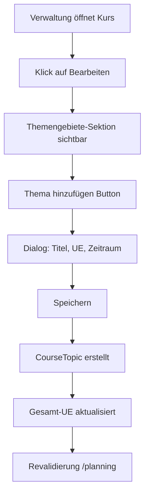
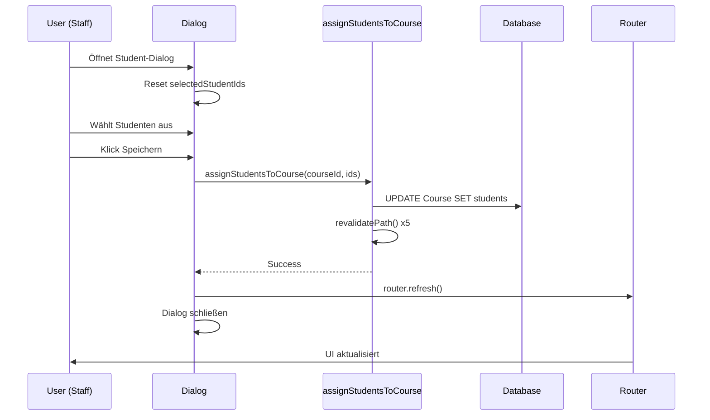
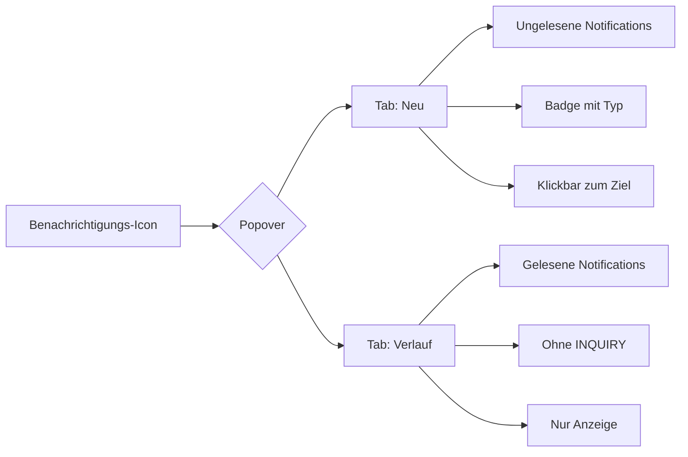
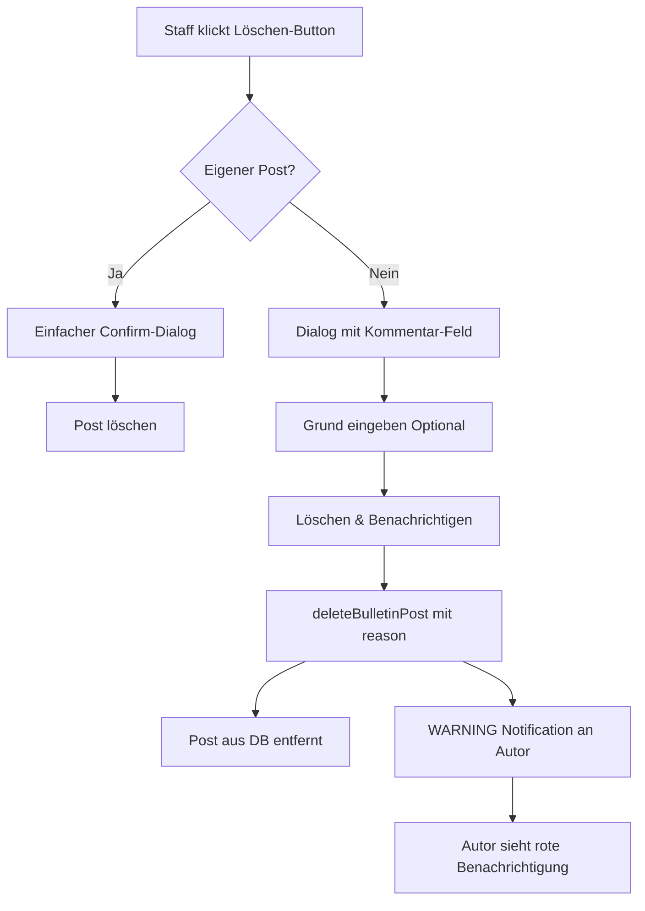
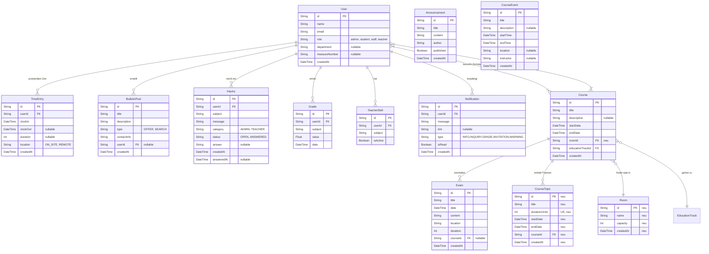

# Schul-Portal-Demo - Technische Dokumentation

## 🆕 Aktuelle Features (Januar 2026)

### 1. 📍 Raum- und Standortverwaltung
**Problem:** Kurse hatten keine physische Zuordnung zu Räumen oder Standorten.

**Lösung:**
- Neues `Room` Model mit Kapazität und Namen
- `Course.roomId` Beziehung für direkte Raum-Zuweisung
- Dropdown-Auswahl bei Kurserstellung und -bearbeitung
- Demo-Räume: Raum 101, 102, 201, Remote/Online, Aula

**Technische Umsetzung:**
```prisma
model Course {
  roomId  String?
  room    Room? @relation(fields: [roomId], references: [id])
}

model Room {
  id       String   @id @default(cuid())
  name     String
  capacity Int      @default(30)
  courses  Course[]
}
```

### 2. 📚 Themengebiete-Management (Course Topics)
**Problem:** Kurse waren monolithische Blöcke ohne strukturierte Untergliederung in Themen mit Zeitplanung.

**Lösung:**
- `CourseTopic` Model mit Titel, UE (Unterrichtseinheiten), Start- und Enddatum
- Visuelle Komponente `CourseTopicsManager` mit CRUD-Funktionen
- Anzeige der Gesamt-UE pro Kurs
- Zeitliche Planung einzelner Themenblöcke

**Mermaid Workflow:**


**API Actions:**
- `createCourseTopicAction()` - Neues Thema erstellen
- `updateCourseTopicAction()` - Thema bearbeiten
- `deleteCourseTopicAction()` - Thema löschen

### 3. 🔄 Student-Zuweisung Fix
**Problem:** Nach Zuweisung von Studenten zu Kursen war kein visuelles Feedback sichtbar, Studenten sahen Kurse nicht in ihrem Kalender.

**Lösung:**
- Dialog resettet `selectedStudentIds` beim Öffnen (fresh data)
- Erweiterte Revalidierung: `/planning`, `/planning/course/{id}`, `/courses`, `/student`, `/dashboard`
- Automatisches Schließen des Popovers nach Aktion
- `router.refresh()` für sofortiges UI-Update

**Datenfluss:**


### 4. 🔔 Intelligentes Benachrichtigungssystem

**Problem:** Alle Benachrichtigungen waren gleich, kein Verlauf, kein Auto-Dismiss.

**Lösung:**

#### 4.1 Notification Types
- `INFO` - Allgemeine Informationen
- `INQUIRY` - Anfragen (werden NICHT im Verlauf gespeichert)
- `GRADE` - Noteneinträge (blauer Badge)
- `INVITATION` - Kurseinladungen (grauer Badge)
- `WARNING` - Warnungen, z.B. Post-Löschungen (roter Badge)

#### 4.2 Auto-Dismiss beim Klick
Wenn eine Notification mit Link angeklickt wird:
1. Notification wird als gelesen markiert (`isRead = true`)
2. Popover schließt sich automatisch
3. Navigation zur verlinkten Seite
4. `router.refresh()` aktualisiert UI

**Code-Flow:**
```typescript
const handleNotificationClick = (notification) => {
  if (notification.link) {
    await markNotificationAsRead(notification.id);
    setOpen(false);  // Popover schließen
    router.push(notification.link);
    router.refresh();
  }
}
```

#### 4.3 Verlauf-Tab
- Separater Tab "Verlauf" neben "Neu"
- Zeigt nur gelesene Notifications (außer INQUIRY-Typ)
- Limitiert auf letzte 50 Einträge
- Visuelle Unterscheidung: grau/transparent, kleinere Schrift

**UI Struktur:**


### 5. 🗑️ Post-Löschung mit Kommentar

**Problem:** Staff konnte Posts löschen, aber Autoren wussten nicht warum.

**Lösung:**

#### Workflow für Staff:


**Notification-Nachricht:**
```
"Dein Beitrag '[Titel]' wurde von der Verwaltung entfernt. 
Grund: [Kommentar oder leer]"
```

**Technische Implementierung:**
- `DeletePostButton` hat `needsReason` prop
- Konditionaler Dialog vs. Confirm
- `deleteBulletinPost(postId, deletionReason?)` 
- Automatische WARNING-Notification mit Typ und rotem Badge

---

## 🚀 Features für zukünftige Planung

Die folgenden Funktionen und Verbesserungen sind für kommende Iterationen des Schul-Portal-Demo geplant. Diese zielen darauf ab, Skalierbarkeit, Benutzererfahrung und administrative Kontrolle zu verbessern.

### 1. 🏗️ Architektur- & Datenbank-Redesign
*   **Datenbankschema-Optimierung:** Bestehende Beziehungen neu bewerten, um Redundanzen zu reduzieren und komplexere Abfragemuster zu unterstützen (z. B. historische Verfolgung von Notenänderungen).
*   **Performance-Tuning:** Implementierung von Datenbank-Indizierungsstrategien und Analyse der Abfrageleistung, um Engpässe bei steigendem Datenvolumen zu vermeiden.
*   **Skalierbarkeits-Check:** Sicherstellen, dass das Datenbankdesign einen signifikanten Anstieg gleichzeitiger Benutzer und Dateneinträge in den nächsten 2-3 Jahren bewältigen kann.

### 2. 🎨 UI/UX Überarbeitung
*   **Moderne Designsprache:** Aktualisierung der Benutzeroberfläche mit einem kohärenteren und zugänglicheren Designsystem, das konsistente Abstände, Typografie und Farbgebung gewährleistet.
*   **Mobile Responsivität:** Gründliches Testen und Verbessern der mobilen Layouts für alle Rollen, um eine nahtlose Nutzung auf Smartphones und Tablets sicherzustellen.
*   **Barrierefreiheit (a11y):** Audit der gesamten Anwendung auf WCAG 2.1-Konformität, um Benutzer mit Behinderungen zu unterstützen (Screenreader, Tastaturnavigation).

### 3. 🧪 Umfassende Teststrategie
*   **Erweiterte Testabdeckung:** Über einfache Unit-Tests hinausgehen und Integration- sowie End-to-End (E2E)-Tests einbeziehen, die kritische Benutzerabläufe abdecken.
*   **Edge-Case-Szenarien:** Gezieltes Testen von Grenzfällen bei rollenbasierter Zugriffskontrolle und Datenvalidierung.
*   **Automatisierte Regressionstests:** Implementierung von CI/CD-Pipelines, die umfassende Testsuiten bei jedem Pull Request ausführen, um Regressionen zu verhindern.

### 4. 📂 Dokumentenmanagementsystem (DMS) / Datei-Uploads
*   **Lehrer-Ressourcen:** Lehrern ermöglichen, Vorlesungsnotizen, Folien und ergänzende Materialien direkt in ihre Kurse hochzuladen.
    *   *Nicht-technischer Leitfaden:* Erstellung einer einfachen Drag-and-Drop-Schnittstelle mit klaren Anweisungen (z. B. "Ziehen Sie Ihr PDF hierher"), um Hürden für nicht-technisches Personal zu minimieren.
*   **Schüler-Hausaufgaben:** Schülern erlauben, Hausaufgaben und Projektdateien direkt in spezifische Kursmodule hochzuladen.
*   **CMS-Integration:** Überlegung zur Integration eines leichtgewichtigen Headless CMS (wie Strapi oder Contentful) oder Aufbau eines dedizierten DMS-Moduls zur Verwaltung von Dateiversionierung und Berechtigungen.

### 5. 💬 Erweiterte Kursinteraktion
*   **Kurskommentare/Ankündigungen:** Hinzufügen eines "Lehrer-Boards" zu jedem Kurs, auf dem Dozenten Updates, Details zum Tech-Stack (z. B. "Wir werden React 19 & Tailwind verwenden") oder kurzfristige Änderungen posten können.
*   **Tech-Stack-Spezifikation:** Lehrern ermöglichen, die spezifischen Technologien zu definieren, die in einem Kursmodul verwendet werden (z. B. Versionsnummern, erforderliche Software), sichtbar in der Kursübersicht.

### 6. 🛠️ Erweiterte Admin-Support-Tools
*   **Impersonation-Modus:** Admins erlauben, das System "als" ein bestimmter Benutzer zu sehen, um Probleme genau so zu beheben, wie der Benutzer sie sieht.
*   **Audit-Logs:** Implementierung einer detaillierten Protokollierung aller administrativen Aktionen (wer hat was wann geändert) für Sicherheit und Rechenschaftspflicht.
*   **System-Health-Dashboard:** Visuelle Echtzeit-Metriken für Serverauslastung, Datenbankverbindungen und Fehlerraten.

---

## 1. Technische Implementierung

Dieses Projekt ist eine moderne Intranet-Anwendung, die mit **Next.js 15** erstellt wurde und den App Router sowie Server Actions für ein nahtloses Full-Stack-Erlebnis nutzt. Das System ist für rollenbasierte Zugriffskontrolle (RBAC) für Schüler, Lehrer, Mitarbeiter und Administratoren ausgelegt.

### Kern-Stack
*   **Framework:** [Next.js 15](https://nextjs.org/) (App Router, Server Components)
*   **Sprache:** TypeScript
*   **Datenbank:** PostgreSQL (via Prisma ORM)
*   **Authentifizierung:** Benutzerdefinierte JWT-basierte Auth mit sicherer Cookie-Verarbeitung (stateless)
*   **UI-Bibliothek:** [Tailwind CSS](https://tailwindcss.com/) + [shadcn/ui](https://ui.shadcn.com/)
*   **Icons:** Lucide React

### Schlüsselkonzepte
*   **Server Actions:** Werden für alle Datenmutationen verwendet (Login, Benutzer erstellen, Anfragen senden). Dies eliminiert die Notwendigkeit einer separaten API-Schicht für interne Funktionen.
*   **Middleware:** `middleware.ts` handhabt den Routenschutz und stellt sicher, dass Benutzer nur auf Seiten zugreifen können, die für ihre Rolle relevant sind (z. B. ist `/admin` für Schüler gesperrt).
*   **Prisma ORM:** Bietet typsicheren Datenbankzugriff. Das Schema ist in `prisma/schema.prisma` definiert.

---

## 2. Architektur

### Datenbankschema (ER-Diagramm)



### Git & Deployment Workflow

1.  **Entwicklung:** Features werden in lokalen Branches entwickelt.
2.  **Prisma Migration:** Datenbankänderungen werden via `npx prisma migrate dev` angewendet.
3.  **Build:** `npm run build` generiert das Produktions-Bundle.
4.  **Start:** `npm start` startet den optimierten Produktionsserver.

---

## 3. Kritische Evaluation

### Code-Qualität & Architektur
*   **Stärken:**
    *   **Modular:** Komponenten sind gut getrennt (z. B. `sidebar.tsx`, `create-inquiry-dialog.tsx`).
    *   **Typsicher:** TypeScript wird konsequent verwendet, was Laufzeitfehler reduziert.
    *   **Sicher:** Server Actions handhaben automatisch CSRF-Schutz; Middleware erzwingt Auth-Regeln.
*   **Schwächen:**
    *   **Komplexität:** Einige Server Components vermischen Datenabruf und UI-Logik zu stark.
    *   **State Management:** Starke Abhängigkeit von lokalem State (`useState`) in einigen komplexen Formularen könnte durch URL-State oder einen globalen Store verbessert werden, wenn die App wächst.

### Engpässe & Technische Schulden
*   **Datenbankabfragen:** Einige Dashboard-Ansichten könnten N+1-Abfrageprobleme auslösen (z. B. Abrufen von Schülern und dann deren Zeiteinträge einzeln).
    *   *Lösung:* Optimierung von Prisma-Abfragen mit `include` oder Raw SQL für komplexe Berichte.
*   **Rollen-Logik:** Rollenbasiertes Rendering erfolgt oft durch einfache `if`-Prüfungen in JSX.
    *   *Lösung:* Abstraktion in `<RoleGuard role="admin">`-Komponenten wäre sauberer.

### Vorgeschlagene Verbesserungen
1.  **Refactoring:** Extrahieren komplexer Datenabrufe in dedizierte "Service"-Dateien (z. B. `lib/services/user-service.ts`).
2.  **Performance:** Implementierung von React `Suspense` für langsam ladende Dashboard-Widgets.
3.  **Testing:** Hinzufügen von E2E-Tests mit Playwright zur Überprüfung kritischer Abläufe wie "Login" und "Clock In".

---

## 4. Learnings

*   **Warum Server Actions?** Sie vereinfachen das mentale Modell, indem sie die Backend-Logik direkt neben der UI halten, die sie auslöst, was den Kontextwechsel reduziert.
*   **Rollen verwalten:** Hardcodierte Rollen (`if role === 'admin'`) sind einfach für den Anfang, werden aber unübersichtlich. Ein robustes Berechtigungssystem (RBAC) wäre besser für die Skalierung.
*   **Shadcn/UI:** Obwohl mächtig, erfordert es, den Code zu "besitzen". Das Anpassen von Komponenten erfordert mehr Aufwand als die Verwendung einer vorgefertigten Bibliothek wie Bootstrap, bietet aber viel mehr Kontrolle.
