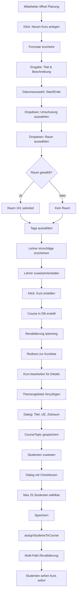
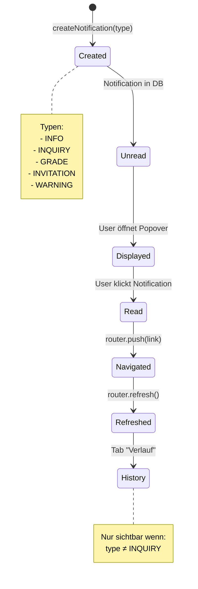
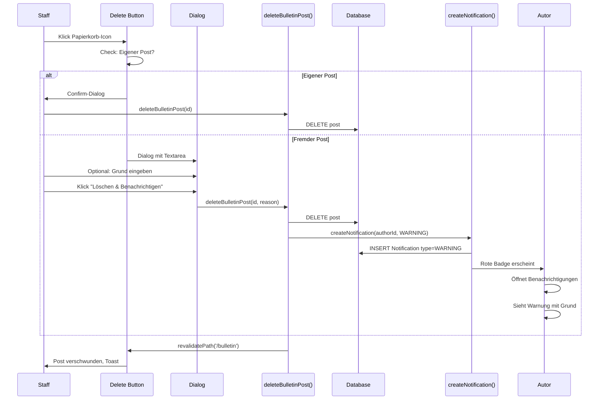

# Schul-Portal-Demo - Präsentation & Demo-Skripte

## 1. Hauptskript (Erzählung)

**Einleitung:**
"Willkommen beim Schul-Portal-Demo, dem zentralen Nervensystem für unsere Bildungseinrichtung. Diese Plattform schlägt die Brücke zwischen Verwaltung, Lehrpersonal und Schülern und bietet eine einheitliche Oberfläche für die Verwaltung des gesamten Bildungszyklus."

**Teil 1: Das Fundament (Administrator)**
"Wir beginnen mit der Administrator-Ansicht. Der Admin ist der Architekt des Systems.
*   **Benutzerverwaltung:** Hier sehen wir eine vollständige Liste aller Benutzer. Der Admin kann neue Konten erstellen, Rollen zuweisen (Schüler, Lehrer, Mitarbeiter) und Berechtigungen verwalten.
*   **Systemgesundheit:** Der Admin hat auch direkten Zugriff auf die Datenbank via Prisma Studio, um die Datenintegrität sicherzustellen."

**Teil 2: Der Organisator (Mitarbeiter/Verwaltung)**
"Als Nächstes wechseln wir zur Mitarbeiter-Rolle – unser organisatorisches Rückgrat.
*   **Ausbildungsgänge (Education Tracks):** Mitarbeiter definieren den akademischen Kalender. Hier erstellen wir einen neuen 'Fachinformatiker 2024'-Jahrgang.
*   **Kursplanung:** Innerhalb dieses Jahrgangs planen wir spezifische Kurse wie 'Webentwicklung' und weisen ihnen Räume und Zeitfenster zu.
*   **Raum-Management:** NEU! Wir können jetzt jedem Kurs einen physischen Raum zuweisen - z.B. 'Raum 101' oder 'Remote/Online'.
*   **Themengebiete:** NEU! Bei der Kursbearbeitung sehen wir eine strukturierte Liste von Themen mit ihren Unterrichtseinheiten (UE) und Zeiträumen. Perfekt für die detaillierte Planung.
*   **Studenten-Zuweisung:** Mit wenigen Klicks weisen wir Studenten zu Kursen zu. Das System aktualisiert sofort alle Ansichten - die Studenten sehen den Kurs direkt in ihrem Dashboard."

**Teil 3: Der Pädagoge (Lehrer)**
"Nun lassen Sie uns die Perspektive des Lehrers sehen.
*   **Meine Kurse:** Lehrer sehen ein Dashboard ihrer aktiven Module.
*   **Prüfungsverwaltung:** Ein kritisches Feature. Der Lehrer erstellt eine neue Prüfung für nächsten Freitag.
*   **Benotung:** Sobald die Prüfung vorbei ist, trägt der Lehrer Noten direkt in das System ein, die sofort für Schüler sichtbar sind."

**Teil 4: Der Lernende (Schüler)**
"Schließlich die Schüler-Ansicht – die am meisten genutzte Oberfläche.
*   **Dashboard:** Nach dem Login sieht der Schüler seinen kommenden Stundenplan und Ankündigungen.
*   **Benachrichtigungen:** NEU! Ein intelligentes System mit farbcodierten Badges. Noten erscheinen in Blau, Warnungen in Rot, Einladungen in Grau. Ein Klick auf eine Benachrichtigung markiert sie automatisch als gelesen und leitet zum Ziel weiter.
*   **Benachrichtigungs-Verlauf:** NEU! Im Verlauf-Tab können Schüler alle vergangenen wichtigen Nachrichten (Noten, Einladungen) einsehen - ohne dass Anfragen den Verlauf überladen.
*   **Zeiterfassung:** Ein wichtiges Compliance-Feature. Der Schüler klickt auf 'Clock In', um seinen Tag zu beginnen und seine Anwesenheit für die Arbeitsagentur zu protokollieren.
*   **Anfragen:** Wenn ein Schüler ein Problem hat, sendet er keine lose E-Mail. Er nutzt den 'Neue Anfrage'-Button, um ein strukturiertes Ticket direkt an die relevante Abteilung zu senden."

**Fazit:**
"Das Schul-Portal-Demo ersetzt fragmentierte Tabellenkalkulationen und E-Mails durch eine einzige, rollenbewusste Anwendung und rationalisiert die Abläufe für alle Beteiligten."

---

## 3. Technische Workflows (Mermaid)

### 3.1 Kurs-Erstellungs-Workflow mit allen Features

### 3.2 Notification Lifecycle

### 3.3 Post-Löschungs-Workflow (mit Moderation)

---

## 2. Rollenbasierte Demo-Skripte

### 🎓 Szenario 1: Schüler (Tagesablauf)
*Ziel: Zeiterfassung, Schwarzes Brett und Kommunikation demonstrieren.*

1.  **Login** als `student@demo.com` -> Dashboard lädt.
2.  **Klick** auf "Zeiterfassung" in der Sidebar -> Zeiterfassungsansicht öffnet sich.
3.  **Klick** auf grünen "Clock In" Button -> Status ändert sich zu "Aktiv", Timer startet.
4.  **Klick** auf "Schwarzes Brett" (Sidebar) -> Schwarzes Brett lädt.
5.  **Klick** auf "Eintrag erstellen" -> Erstelle einen "Suche Nachhilfe" Post mit 7 Tagen Laufzeit.
6.  **Klick** auf "Neue Anfrage" (Sidebar) -> Dialog öffnet sich.
7.  **Wähle** "Verwaltung (Allgemein)" -> Betreff: "Krankmeldung", Nachricht: "Bin heute krank."
8.  **Klick** auf "Absenden" -> Erfolgsmeldung erscheint.

### 👨‍🏫 Szenario 2: Lehrer (Prüfungsverwaltung)
*Ziel: Eine Prüfung planen und benoten.*

1.  **Login** als `teacher@demo.com` -> Lehrer-Dashboard lädt.
2.  **Klick** auf "Prüfungsverwaltung" -> Liste der Prüfungen erscheint.
3.  **Klick** auf "Prüfung erstellen" -> Formular öffnet sich.
4.  **Eingabe** Titel: "React Basics", Datum: Morgen -> Prüfung erscheint in der Liste.
5.  **Klick** auf "Noten eintragen" (bei einer bestehenden Prüfung) -> Schülerliste öffnet sich.
6.  **Eingabe** Note "1.0" für einen Schüler -> Speicherbestätigung erscheint.

### 🏢 Szenario 3: Mitarbeiter (Kursplanung)
*Ziel: Einen neuen Ausbildungsgang einrichten.*

1.  **Login** als `staff@demo.com` -> Mitarbeiter-Dashboard lädt.
2.  **Klick** auf "Planung" -> Übersicht der Ausbildungsgänge erscheint.
3.  **Klick** auf "Neuer Jahrgang" -> Eingabe "Winter 2024".
4.  **Klick** auf den neuen Track -> Track-Details öffnen sich.
5.  **Klick** auf "Kurs hinzufügen" -> Erstelle Kurs "Einführung in KI".

### 🏢 Szenario 3b: Mitarbeiter (Erweiterte Kursverwaltung) ⭐ NEU
*Ziel: Kurs detailliert konfigurieren mit Raum, Themen und Studenten.*

1.  **Login** als `staff@demo.com` -> Mitarbeiter-Dashboard lädt.
2.  **Klick** auf "Planung" -> Übersicht erscheint.
3.  **Klick** auf "Bearbeiten" bei einem bestehenden Kurs -> Dialog öffnet sich.
4.  **Raum auswählen:** Dropdown "Raum / Standort" -> Wähle "Raum 101" -> Speichern.
5.  **Themen hinzufügen:** 
    - Scrolle zu "Themengebiete" Sektion
    - Klick "Thema hinzufügen"
    - Eingabe: Titel "React Hooks", UE "40", Zeitraum "01.02.2026 - 15.02.2026"
    - Speichern -> Thema erscheint mit UE-Badge
6.  **Studenten zuweisen:**
    - Scrolle zu "Teilnehmer (Studenten)" Sektion
    - Klick "Schüler verwalten"
    - Checkboxen: Wähle 3 Studenten aus (max 25)
    - Speichern -> Dialog schließt, Liste aktualisiert sich sofort
7.  **Validierung:** Studenten sehen den Kurs jetzt in ihrem Dashboard/Kalender.

### 🛡️ Szenario 4: Admin (Benutzerverwaltung)
*Ziel: Einen neuen Benutzer anlegen.*

1.  **Login** als `admin@demo.com` -> Admin-Dashboard lädt.
2.  **Klick** auf "Admin" (Sidebar) -> Benutzerliste erscheint.
3.  **Klick** auf "Add User" -> Dialog öffnet sich.
4.  **Eingabe** Name: "Max Mustermann", Rolle: "Student" -> Benutzer erscheint in der Liste.
5.  **Klick** auf "Skill Freigaben" -> Überprüfe ausstehende Skill-Anfragen.

### 👮 Szenario 5: Mitarbeiter (Content-Moderation) ⭐ NEU
*Ziel: Unangemessenen Post löschen mit Begründung.*

1.  **Login** als `staff@demo.com` -> Dashboard lädt.
2.  **Klick** auf "Schwarzes Brett" -> Alle Posts sichtbar.
3.  **Identifiziere** problematischen Post (z.B. unpassender Inhalt).
4.  **Klick** auf Papierkorb-Icon beim Post -> Dialog öffnet sich.
5.  **Textarea** erscheint: "Grund für die Löschung (Optional)"
6.  **Eingabe:** "Verstößt gegen Community-Richtlinien: Werbung für externe Dienste"
7.  **Klick** "Löschen & Benachrichtigen" -> Post verschwindet.
8.  **Autor-Perspektive:** 
    - Autor erhält sofort eine ROTE Benachrichtigung
    - Badge zeigt "Warnung"
    - Nachricht: "Dein Beitrag 'XYZ' wurde von der Verwaltung entfernt. Grund: Verstößt gegen..."
9.  **Verlauf:** Diese Warnung bleibt NICHT im Verlauf-Tab (nur aktive Warnungen).

### 🔔 Szenario 6: Schüler (Benachrichtigungs-Workflow) ⭐ NEU
*Ziel: Mit verschiedenen Notification-Typen interagieren.*

1.  **Login** als `student@demo.com` -> Dashboard mit Notifications-Badge (z.B. "3").
2.  **Klick** auf Glocken-Icon -> Popover mit Tabs "Neu (3)" und "Verlauf".
3.  **Tab "Neu":**
    - 1x BLAUE Badge "Note": "Neue Note eingetragen für Prüfung: 1.0"
    - 1x GRAUE Badge "Einladung": "Lehrer lädt dich ein..."
    - 1x INFO Badge: "Neue Anfrage beantwortet"
4.  **Klick** auf die "Note"-Notification:
    - Dialog schließt automatisch
    - Weiterleitung zu `/profile`
    - Notification verschwindet aus "Neu"
    - Badge-Zahl: "3" → "2"
5.  **Klick** erneut auf Glocke -> Tab "Verlauf":
    - Die "Note"-Notification erscheint jetzt hier
    - In grauer, kleinerer Schrift
    - Nur zur Ansicht (nicht klickbar)
    - Anfragen-Notifications fehlen hier (bleiben nur unter "Neu")
6.  **Vorteil:** Schüler kann vergangene wichtige Infos (Noten, Einladungen) nachschlagen, ohne dass Anfragen-Spam den Verlauf füllt.
